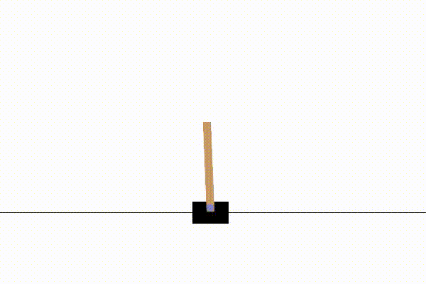

# reinforcementLearning
# Deep Q-Network (DQN) CartPole — PyTorch + Gymnasium

This repository contains a **clean implementation of Deep Q-Learning (DQN)** for the CartPole environment using **PyTorch** and **Gymnasium**.
The implementation includes the core components used in modern reinforcement learning systems:

* Online Q-Network
* Target Network
* Experience Replay Buffer
* Epsilon-Greedy Exploration
* Model Saving
* Evaluation Script with Video Recording

The project is designed to be **simple, modular, and easy to extend** with additional reinforcement learning algorithms.

---

# Environment

The agent is trained on the **CartPole-v1** control task.

Goal:

Keep the pole balanced on a moving cart for as long as possible by choosing actions:

* `0` → move cart left
* `1` → move cart right

State space:

```
[cart_position, cart_velocity, pole_angle, pole_angular_velocity]
```

Reward:

```
+1 for every timestep the pole remains balanced
```

Episode ends if:

* Pole angle exceeds threshold
* Cart moves too far from center
* Episode reaches time limit (500 steps)

---

# Algorithm

The implementation follows the **Deep Q-Network (DQN)** algorithm.

Key idea:

Instead of storing a large Q-table, a neural network approximates the Q-function:

```
Q(s, a) ≈ NeuralNetwork(s)
```

Training uses the target:

```
Q_target = r + γ * max_a' Q_target(s', a')
```

Main components:

| Component      | Purpose                              |
| -------------- | ------------------------------------ |
| Online Network | Learns Q-values                      |
| Target Network | Stabilizes learning                  |
| Replay Buffer  | Breaks temporal correlations         |
| Epsilon Greedy | Balances exploration vs exploitation |
| Target Updates | Prevents moving target instability   |

---

# Project Structure

```
dqn_cartpole/
│
├── model.py
├── replay_buffer.py
├── train.py
├── evaluate.py
├── videos/
└── README.md
```

Description:

| File               | Description                          |
| ------------------ | ------------------------------------ |
| `model.py`         | Neural network architecture          |
| `replay_buffer.py` | Experience replay memory             |
| `train.py`         | Training script                      |
| `evaluate.py`      | Runs trained model and records video |
| `videos/`          | Saved evaluation recordings          |

---

# Installation

Install dependencies:

```
pip install gymnasium[classic-control] torch numpy imageio imageio-ffmpeg
```

---

# Training

Run training with:

```
python train.py
```

During training you will see output like:

```
Episode 10 Reward 45
Episode 50 Reward 120
Episode 150 Reward 200
```

Once training completes, the model is saved as:

```
dqn_cartpole_targetnet.pth
```

---

# Evaluation

Run the trained agent:

```
python evaluate.py
```

The script will:

1. Load the trained model
2. Run the environment
3. Save a video of the agent

Video output will be saved to:

```
videos/rl-video-episode-0.mp4
```

---

# Example Result

Below is a recording of the trained DQN agent balancing the pole.

**Video demonstration**

[ipynb/videos/rl-video-episode-0.mp4](ipynb/videos/rl-video-episode-0.mp4)

## Demo

[](ipynb/videos/rl-video-episode-0.mp4)

After training, the agent typically achieves:

```
200+ reward consistently
```

Which solves the CartPole environment.

---

# Future Work

This repository will be extended to include additional reinforcement learning algorithms.

Planned implementations:

* Policy Gradient (REINFORCE)
* Actor-Critic
* Advantage Actor-Critic (A2C)
* Proximal Policy Optimization (PPO)
* Double DQN
* Dueling DQN
* Prioritized Experience Replay

The goal is to make this repository a **small collection of reinforcement learning algorithms implemented from scratch**.

---
```


